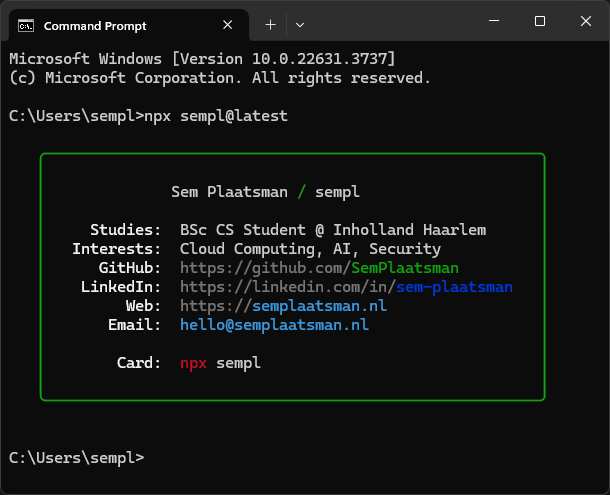

This is my NPX Business Card repository.

# Usage

## Terminal
```
npx sempl@latest
```

## <span title="Taken @ 8-7-2024">Result</span>


## Credit

Forked from [@bitandbang](https://github.com/bnb/bitandbang)  
Based on [Creating a business card for the terminal](https://dev.to/dailydevtips1/creating-a-business-card-for-the-terminal-3hel)
